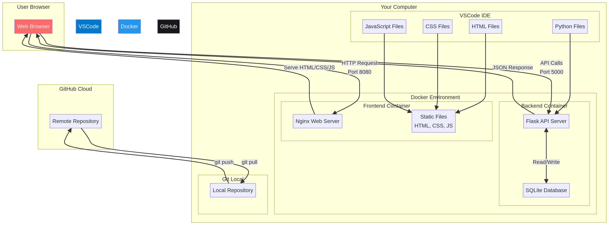

# Detailed Code Explanation

This document provides a detailed explanation of each component in the Task Manager application, helping you understand how everything works together.

## Architecture Overview



The diagram above shows how all the components interact with each other. Let's break down each part:

## Front-End Components

### index.html - The Structure

The HTML file defines the structure of our web page. Here are the key parts:

```html
<div class="container">
    <h1>📝 My Task Manager</h1>
    
    <div class="add-task-section">
        <input type="text" id="taskInput" placeholder="Enter a new task...">
        <button id="addBtn" onclick="addTask()">Add Task</button>
    </div>

    <div class="tasks-section">
        <h2>Tasks</h2>
        <ul id="taskList">
            <!-- Tasks will be loaded here -->
        </ul>
    </div>
</div>
```

**What's happening here:**
- The `container` div wraps everything and provides styling boundaries
- The `add-task-section` contains an input field and a button for adding new tasks
- The `taskList` is where all tasks will be dynamically inserted by JavaScript

### style.css - The Presentation

The CSS file makes our application look good. Some key concepts:

```css
.container {
    max-width: 600px;
    margin: 0 auto;
    background: white;
    border-radius: 10px;
    padding: 30px;
    box-shadow: 0 10px 40px rgba(0, 0, 0, 0.2);
}
```

**What this does:**
- `max-width: 600px` - Keeps the content from getting too wide on large screens
- `margin: 0 auto` - Centers the container horizontally
- `border-radius: 10px` - Rounds the corners
- `box-shadow` - Adds a shadow for depth

### app.js - The Behavior

This is where the magic happens. Let's break down the key functions:

#### Loading Tasks

```javascript
async function loadTasks() {
    try {
        const response = await fetch(`${API_URL}/tasks`);
        const tasks = await response.json();
        
        // Display tasks in the UI
        tasks.forEach(task => {
            const taskElement = createTaskElement(task);
            taskList.appendChild(taskElement);
        });
    } catch (error) {
        console.error('Error loading tasks:', error);
    }
}
```

**What's happening:**
1. `fetch()` makes an HTTP request to our backend API
2. `await` waits for the response (this is asynchronous programming)
3. `.json()` converts the response to JavaScript objects
4. We loop through each task and create HTML elements for them

#### Adding a Task

```javascript
async function addTask() {
    const input = document.getElementById('taskInput');
    const title = input.value.trim();
    
    const response = await fetch(`${API_URL}/tasks`, {
        method: 'POST',
        headers: {
            'Content-Type': 'application/json',
        },
        body: JSON.stringify({ title: title })
    });
    
    if (response.ok) {
        input.value = '';
        loadTasks();
    }
}
```

**What's happening:**
1. Get the text from the input field
2. Send a POST request to the backend with the task title
3. If successful, clear the input and reload the task list

## Back-End Components

### app.py - The API Server

This file creates a REST API using Flask. Let's examine the key parts:

#### Setting Up Flask

```python
from flask import Flask, jsonify, request
from flask_cors import CORS

app = Flask(__name__)
CORS(app)  # Allow requests from the frontend
```

**What this does:**
- Creates a Flask application instance
- Enables CORS (Cross-Origin Resource Sharing) so the frontend can communicate with the backend

#### API Endpoints

```python
@app.route('/api/tasks', methods=['GET'])
def get_tasks():
    tasks = database.get_all_tasks()
    return jsonify(tasks)
```

**What this does:**
- `@app.route()` is a decorator that tells Flask which URL should trigger this function
- `methods=['GET']` specifies this endpoint only responds to GET requests
- `jsonify()` converts Python objects to JSON format

```python
@app.route('/api/tasks', methods=['POST'])
def create_task():
    data = request.get_json()
    title = data['title']
    task_id = database.create_task(title)
    return jsonify({'id': task_id}), 201
```

**What this does:**
- Accepts POST requests to create new tasks
- Extracts the JSON data from the request
- Calls the database function to create the task
- Returns the new task's ID with a 201 status code (Created)

### database.py - The Data Layer

This file handles all database operations:

#### Initializing the Database

```python
def init_db():
    conn = sqlite3.connect(DB_PATH)
    cursor = conn.cursor()
    
    cursor.execute('''
        CREATE TABLE IF NOT EXISTS tasks (
            id INTEGER PRIMARY KEY AUTOINCREMENT,
            title TEXT NOT NULL,
            completed BOOLEAN NOT NULL DEFAULT 0,
            created_at TIMESTAMP DEFAULT CURRENT_TIMESTAMP
        )
    ''')
    
    conn.commit()
    conn.close()
```

**What this does:**
- Connects to the SQLite database (creates it if it doesn't exist)
- Creates a `tasks` table with four columns:
  - `id`: Unique identifier (auto-increments)
  - `title`: The task description
  - `completed`: Whether the task is done (0 = false, 1 = true)
  - `created_at`: Timestamp when the task was created

#### CRUD Operations

**Create:**
```python
def create_task(title):
    conn = get_connection()
    cursor = conn.cursor()
    cursor.execute('INSERT INTO tasks (title, completed) VALUES (?, ?)', (title, False))
    task_id = cursor.lastrowid
    conn.commit()
    conn.close()
    return task_id
```

**Read:**
```python
def get_all_tasks():
    conn = get_connection()
    cursor = conn.cursor()
    cursor.execute('SELECT * FROM tasks ORDER BY created_at DESC')
    tasks = cursor.fetchall()
    conn.close()
    return [dict(task) for task in tasks]
```

**Update:**
```python
def toggle_task(task_id):
    conn = get_connection()
    cursor = conn.cursor()
    cursor.execute('UPDATE tasks SET completed = NOT completed WHERE id = ?', (task_id,))
    conn.commit()
    conn.close()
```

**Delete:**
```python
def delete_task(task_id):
    conn = get_connection()
    cursor = conn.cursor()
    cursor.execute('DELETE FROM tasks WHERE id = ?', (task_id,))
    conn.commit()
    conn.close()
```

## Docker Components

### Dockerfile.backend - Backend Container

```dockerfile
FROM python:3.11-slim
WORKDIR /app
COPY backend/requirements.txt .
RUN pip install --no-cache-dir -r requirements.txt
COPY backend/ .
EXPOSE 5000
CMD ["python", "app.py"]
```

**What each line does:**
1. `FROM python:3.11-slim` - Start with a lightweight Python 3.11 image
2. `WORKDIR /app` - Set the working directory inside the container
3. `COPY backend/requirements.txt .` - Copy the requirements file
4. `RUN pip install...` - Install Python dependencies
5. `COPY backend/ .` - Copy all backend code
6. `EXPOSE 5000` - Document that the container listens on port 5000
7. `CMD ["python", "app.py"]` - Command to run when the container starts

### Dockerfile.frontend - Frontend Container

```dockerfile
FROM nginx:alpine
COPY frontend/ /usr/share/nginx/html/
COPY nginx.conf /etc/nginx/conf.d/default.conf
EXPOSE 80
```

**What each line does:**
1. `FROM nginx:alpine` - Start with a lightweight Nginx image
2. `COPY frontend/...` - Copy all frontend files to Nginx's web root
3. `COPY nginx.conf...` - Copy custom Nginx configuration
4. `EXPOSE 80` - Document that the container listens on port 80

### docker-compose.yml - Orchestration

```yaml
version: '3.8'

services:
  backend:
    build:
      context: .
      dockerfile: Dockerfile.backend
    ports:
      - "5000:5000"
    networks:
      - task-manager-network

  frontend:
    build:
      context: .
      dockerfile: Dockerfile.frontend
    ports:
      - "8080:80"
    depends_on:
      - backend
    networks:
      - task-manager-network

networks:
  task-manager-network:
    driver: bridge
```

**What this does:**
- Defines two services: `backend` and `frontend`
- Maps ports from the container to your host machine
- Creates a network so the containers can communicate
- `depends_on` ensures the backend starts before the frontend

## How It All Works Together

1. **User opens the browser** and goes to `http://localhost:8080`
2. **Nginx (frontend container)** serves the HTML, CSS, and JavaScript files
3. **JavaScript runs in the browser** and calls `loadTasks()`
4. **JavaScript makes an HTTP request** to `http://localhost:5000/api/tasks`
5. **Flask (backend container)** receives the request
6. **Flask calls the database** to get all tasks
7. **SQLite returns the data** to Flask
8. **Flask sends JSON response** back to the browser
9. **JavaScript receives the data** and creates HTML elements for each task
10. **User sees the tasks** displayed on the page

When the user adds a task, the process is similar but uses a POST request instead of GET.

## Key Concepts

### REST API

REST (Representational State Transfer) is an architectural style for APIs. Our API follows these principles:

- **GET /api/tasks** - Retrieve resources
- **POST /api/tasks** - Create a new resource
- **PUT /api/tasks/:id/toggle** - Update a resource
- **DELETE /api/tasks/:id** - Delete a resource

### Asynchronous Programming

JavaScript uses `async/await` to handle operations that take time (like network requests) without blocking the rest of the code:

```javascript
async function loadTasks() {
    const response = await fetch(`${API_URL}/tasks`);
    // Wait for the response before continuing
    const tasks = await response.json();
}
```

### Containerization Benefits

Docker containers provide several advantages:

1. **Consistency**: The application runs the same way everywhere
2. **Isolation**: Dependencies don't conflict with other projects
3. **Portability**: Easy to move between development, testing, and production
4. **Reproducibility**: Anyone can run your exact setup with one command

### Version Control

Git tracks changes to your code over time. Key concepts:

- **Commit**: A snapshot of your code at a point in time
- **Branch**: A separate line of development
- **Remote**: A copy of your repository on GitHub
- **Push**: Send your commits to the remote
- **Pull**: Get commits from the remote

## Next Steps for Learning

Now that you understand the basics, you can:

1. **Add authentication** - Let users create accounts and log in
2. **Add task categories** - Organize tasks by project or category
3. **Add due dates** - Track when tasks need to be completed
4. **Deploy to the cloud** - Put your app on AWS, Azure, or Heroku
5. **Learn a frontend framework** - Try React, Vue, or Angular
6. **Add automated tests** - Ensure your code works as expected

Happy coding!
